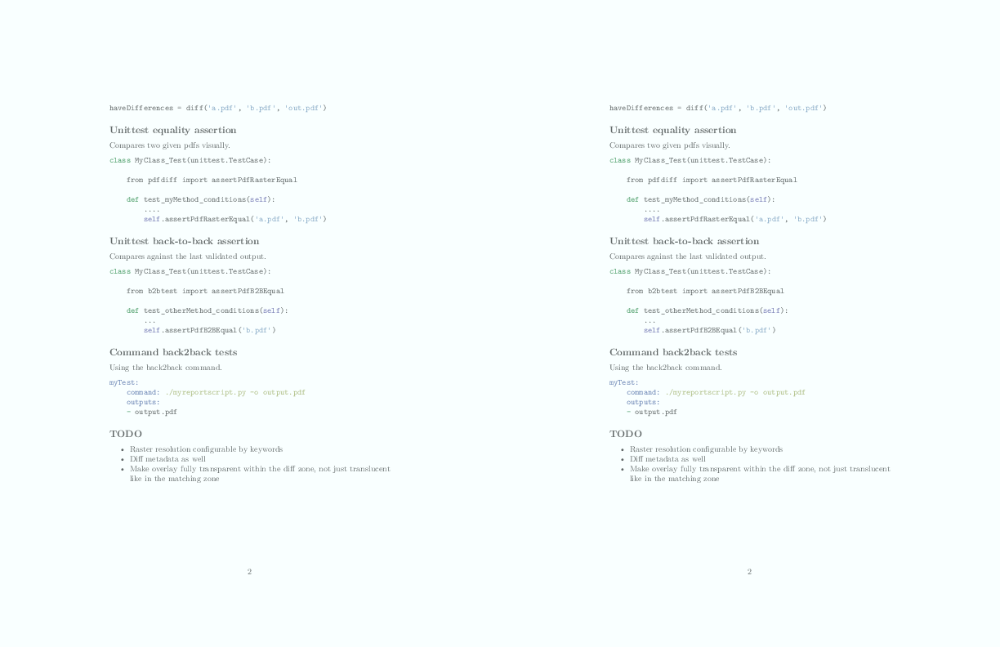

# Visual PDF diff

Visual side by side comparision of rendered PDF documents.

You can use this in several ways:

- a commandline tool to obtain the diff of two pdfs
- a Python function to do the same from other Python programs
- an equality assertion to be used in `python-unittest`
- a back-to-back assertion to be used in `python-unittest`
- an extension for `python-back2back` to make back-to-back tests

The generated diff looks like this:



## Comand line diff tool

```bash
visualpdfdiff a.pdf b.pdf [output-diff.pdf]
```

Returns 0 if both pdfs are raster equal, -1 if they are not.

If an output is provided the side-by-side diff pdf is generated.
Not providing an output is faster when diff exists, though.

## Python diff function

```python
from visualpdfdiff import diff

haveDifferences = diff('a.pdf', 'b.pdf', 'out.pdf')
```

## Unittest equality assertion

Compares two given pdfs visually.

```python
class MyClass_Test(unittest.TestCase):

	from pdfdiff import assertPdfRasterEqual

	def test_myMethod_conditions(self):
		....
		self.assertPdfRasterEqual('a.pdf', 'b.pdf')

```

## Unittest back-to-back assertion

Compares against the last validated output.

```python
class MyClass_Test(unittest.TestCase):

	from b2btest import assertPdfB2BEqual

	def test_otherMethod_conditions(self):
		...
		self.assertPdfB2BEqual('b.pdf')
```

## Command back2back tests

Using the back2back command.

```yaml
myTest:
	command: ./myreportscript.py -o output.pdf
	outputs:
	- output.pdf
```


## TODO

- Raster resolution configurable by keywords
- Diff metadata as well
- Make overlay fully transparent within the diff zone, not just translucent like in the matching zone


