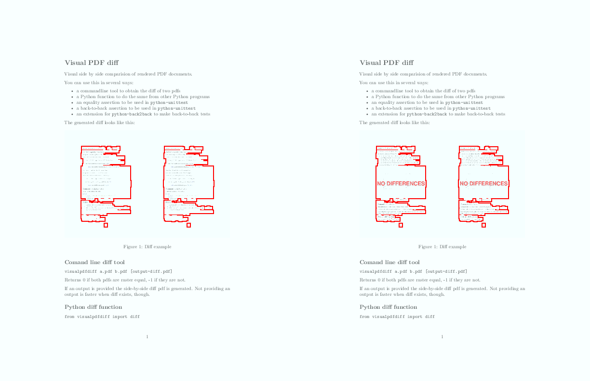

# Visual PDF diff

Visual side by side comparision of rendered PDF documents.

You can use this in several ways:

- a commandline tool to obtain the diff of two pdfs
- a Python function to do the same from other Python programs
- an equality assertion to be used in `python-unittest`
- a back-to-back assertion to be used in `python-unittest`
- an extension for the tool [`back2back`](https://github.com/vokimon/back2back) to make back-to-back tests of the PDF outputs of your commands

The generated diff looks like this:



## Installation

```
sudo apt install imagemagick # Or the equivalent if not debian based
pip install visualpdfdiff
pip install b2btest # if you want to use the back2back command
```

NOTE: visualpdfdiff requires enabling ImageMagick to handle PDF.
This is disabled by default for security reasons.
If you are running a web server accepting PDF files from outside,
please, consider the security implications.

Edit `/etc/ImageMagick-*/policy.xml` and 
uncomment th line:
```xml
<policy domain="coder" rights="read | write" pattern="PDF" />
```
And comment the line:
```xml
<!-- <policy domain="coder" rights="none" pattern="PDF" /> -->
```

## Comand line diff tool

```bash
visualpdfdiff a.pdf b.pdf [output-diff.pdf]
```

Returns 0 if both pdfs are raster equal, -1 if they are not.

If an output is provided the side-by-side diff pdf is generated.
Not providing an output is faster when diff exists, though,
so checking and then generating is faster when you expect, being equal most of the time.

## Python diff function

```python
from visualpdfdiff import diff

haveDifferences = diff('a.pdf', 'b.pdf', 'out.pdf')
```

## Unittest back-to-back assertion

Compares against the last validated output.
If the extension is PDF, visualpdfdiff will be chosen to detect and output the differences.

```python
class MyClass_Test(unittest.TestCase):

	from b2btest import assertB2BEqual

	def test_otherMethod_conditions(self):
		...
		self.assertB2BEqual('b.pdf')
```

## Command back2back tests

Using the back2back command.
Also, by installing this package, PDF outputs are compared using visualpdfdiff.

```yaml
myTest:
  command: ./myreportscript.py -o output.pdf
  outputs:
  - output.pdf
```

## CHANGES

### 1.0 (Unreleased)

- First version as independent module
- Previous versions were part of somenergia-oomakotest a test suite to compare outputs of mako reports generated by odoo

## TODO

- Raster resolution configurable by keywords
- Diff metadata as well
- Make overlay fully transparent within the diff zone, and just translucent like in the matching zone


## Similar tools

- [pdfdiff:](https://github.com/JoshData/pdf-diff)
	Extracts text and diff that, then draws an outline on the text.
	Better for text diffing, but not so for layout diffing.
- [qtrac's diffpdf:](http://www.qtrac.eu/diffpdf-foss.html)
	A quite nice (qt-based) graphical tool that does both text and visual diffing.
	Is not maintained anymore since the authors moved to a close source license.
- [vslavik's diff-pdf:](https://vslavik.github.io/diff-pdf/)

